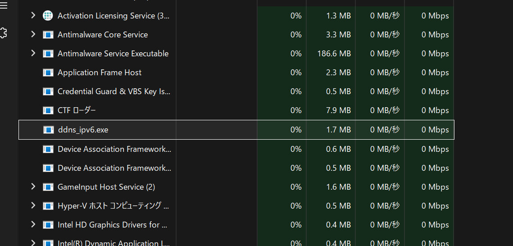

# Cloudflare DDNS IPv6 for Windows

一个轻量级的 Windows C++ 客户端，用于在后台运行并将本地的 IPv6 地址更新到 Cloudflare DNS 记录中。程序会持续监控你的 IPv6 地址，一旦发现变动，就会调用 Cloudflare 的 API 进行更新。

[Read this in English](README.md)

## 运行截图

<!-- 请确保 screenshot.jpg 位于与 README_zh.md 相同的目录下，图片即可在此处显示 -->


## 特性

- **原生 Windows API**：纯使用 Windows 自身 API（`WinHTTP` 和 `Iphlpapi`）构建，不需要任何第三方依赖（如 libcurl 或 OpenSSL）。
- **静默运行**：程序完全在后台运行，不会弹出难看的控制台黑框。
- **防止多开**：通过互斥锁 (Mutex) 机制，确保同时只有一个实例在运行。
- **简单配置**：通过同目录下的 `config.ini` 文件动态读取配置，不再需要硬编码。

## 安装与使用

1. 从 [Releases](https://github.com/) 页面下载最新编译的 `exe` 文件（或者你自己编译）。
2. 将程序放在任意你喜欢的文件夹中。
3. 双击运行程序。如果程序检测到配置文件不存在，会在同目录下自动生成一个 `config.ini` 模板，并弹出提示框提醒你进行配置。
4. 打开生成的 `config.ini`，填入你的 Cloudflare 账号信息：

```ini
API_TOKEN=your_cloudflare_api_token
DNS_NAME=sub.yourdomain.com
ZONE_NAME=yourdomain.com
SLEEP_INTERVAL_SEC=3600
```

- `API_TOKEN`: 你的 Cloudflare API Token（需要具备修改 DNS 记录的权限）。
- `DNS_NAME`: 你想要更新的完整二级域名（例如：`ddns.example.com`）。
- `ZONE_NAME`: 你的主域名（例如：`example.com`）。
- `SLEEP_INTERVAL_SEC`: 检查 IP 变动的时间间隔，单位为秒（默认 3600 秒，即 1 小时）。

5. 保存 `config.ini` 并再次运行程序，它将在后台静默工作。

## 编译指南 (MSVC)

如果你想自己使用 Microsoft Visual C++ (MSVC) 编译本项目：

1. 打开 "x64 Native Tools Command Prompt for VS" (适用于 VS 的 x64 本机工具命令提示符)。
2. 使用 `cd` 命令进入源代码目录。
3. 执行以下编译命令：

```cmd
cl.exe ddns_ipv6.cpp /EHsc /O2 /link /out:cfddns-ipv6.exe
```

## 协议
MIT License
